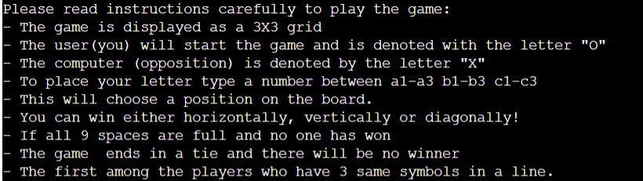
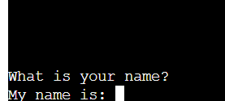

# TICTACTOE Game - Python

## Introduction

Tic Tac Toe game is the third project challenge with Code Institute in order to acquire the Full Stack Developer Diploma. The game is created using Python, as required.

Two players take turns drawing a "O" or a "X" on one square of a nine-square grid in the game of tic-tac-toe, which is played against the computer.
The first person to line up three identical symbols horizontally, vertically, or diagonally wins!

Please find the live project [here:](https://p3-tic-tac-toe.herokuapp.com/) 

## Table Of Contents

+ [UX](#ux "UX")
  + [User Stories](#userstories "User Stories")
    + [As a player:](#first-time-user "As a player")
+ [Features](#features "Features")  
  + [Introduction](#Introduction "Introduction")
  + [Instructions](#Instructions "Instructions") 
  + [Start Game](#Start-Game "Start Game")
  + [Play Game](#Start-Game "Play Game")
+ [Future Features](#future-features "Future Features") 
+ [External Sources Used](#external-sources-used "External Sources Used")  
+ [Python Libraries Used](#python-libraries-used "Python Libraries Used")  
+ [Testing](#testing "Testing")
+ [Bugs and Solutions](#bugs-and-solutions "Bugs and Solutions")
+ [Development and Deployment](#development-and-deployment "Development and Deployment")
+ [Credits](#Credits "Credits")

## UX:
### User Stories
#### As a player

- I want to play a game with clear and easy instructions
- I want to be able to see my scores
- I want to be able to play quit easily    

## Existing Features:

### Introduction

Once the program runs, the user is welcomed to the game and they are asked them to insert their name. This will be used through the game for fidelization purposes. And in future implementation to be able to share their scores.
The "welcome to the game" statement has a sys.stdout.flush() method applied for a better visual effect.

 

### Instructions

After the validated name is inserted, a small explaination of the rules is shown , as per screenshot below:

 

### Enter name

After the player has read the instruction he can then input his name to start playing.
 

### Invalid Entry.

In this stage if the player enters the numbers and not letters ,there is an error message that appears and indicates the error.
 

### Start Game

In the next step the user is asked to type "S" to start playing. Thanks to the validation applied, the terminal will accept any "S" format, uppercase or lowercase, if the element typed by the user is different that "S" they will get an error message stating to type "S" again, correctly.

 

### Play Game

The user will get to play first, with the symbol 'O', while the PC will be shown as "X". Based on the spot typed, from 1 to 9, the board will be filled with the relative symbol.
The game is fully validated, so if the user chooses a spot that is already taken, they will get the relative "error" message. In case of a win, the score will incerement and will be shown right on top on the game board.

### Play Again or quit

Once the game is finished, a "Game ended" message is printed, and the user will have the option to start again (keeping the previous score), or quit the game. In case they want to quit, a thank you message will be printed.

 
[Back to top](#table-of-contents)

## Future Features

- Give an option to the user to choose the symbol they want
- Let user decide if they want to go first or second
- Implement as option to allow the user to play with someone else, rather than just against the computer
- Allow the user to be able to share their score
- Make an impossible to win game, against the computer

## Technology Used

 - [Python](https://www.python.org/) 
 - [JavaScript](https://www.javascript.com/) provided in the Code Institute Template
 - [CSS](https://en.wikipedia.org/wiki/CSS)  provided in the Code Institute Template
 - [HTML](https://en.wikipedia.org/wiki/HTML)  provided in the Code Institute Template

## External Sources Used

- Stack Overflow
- W3 School
- Youtube
- [Am I Responsive](https://ui.dev/amiresponsive) to create the main image for README file

## Python Libraries Used

- [Random](https://docs.python.org/3/library/random.html)  for computer random moves 
- [Time and Sleep](https://realpython.com/python-sleep/) for text animation / disappearence
- [Sys](https://docs.python.org/3/library/sys.html)  for specific parameters and functions

## Testing

Testing was conducted very carefully through the entire project. Pep 8 validator came back with no issues
[Pep8](http://pep8online.com/)

### Exception/Error testing:

- User's name validation was tested checking all possible inputs. Empty spaces, numbers or symbols not accepted.

- Start game input validated carefully, testing all possible inputs. Empty spaces, numbers or symbols not accepted. Lower or Uppercase 'S' accepted.

- Spot on board input validated carefully, testing all possible inputs. Empty spaces, letters or symbols not accepted.

- Already occupied spot on board input validated, tested all possible inputs. 

- Quit or play input validated too. 1 for play again and 'Q' uppercase or lowercase allowed.

- Python pylint reports currently 3 main and known issues:

  - Using the global statement: global statement is used during the creation of the game to access global variables, listed at the top of python file. The usage of 'global' is not fully recommended as it can make harder to detect bugs and issuees in a very big program, however building Tic Tac Toe game as a beginner, I found it a simple approach to define the global variables in the begining of the file and access them later whenever needed in the functions.

  - Constant name 'variable' doesn't conform to UPPER_CASE naming style: variable used are not indended as constant in this game, they respect the expected naming conventions, furthermore the code passes Pep8 Validator correctly.

  - Redefining  name 'board' from outer the scope: this issue passes through Pep8 as well. This was used for clarity purposes. As per Mentor and Tutors confirmation, again, Pep8 did not detect any issue regarding this Pylint error.

## Bugs and Solutions

- Function for scores was not working, it was not being called correctly. Fixed the issue by calling it in  who_is_the_winner(board) function, right after checking win for all possible rows.

- Method to make 'Game starting' disappear after few second was not working'. Needed to implement print(" " * len(game_starting), end="\r").

- Name and move input validation was not fully functional. Went back to 'Love Sandwiches' video for exceptions/errors, and implemented the code with the correct syntax.

## Development and Deployment

This project was developed through Gitpod, using the template provided by Code Institute. Every step was documented and pushed thoroughly via GitHub.

The deployment is made using [Heroku](https://www.heroku.com/) following the listed steps:

1. Log in or register a new account on Heroku
2. Click on 'New' in the dashboard and select 'Create New App'
3. Select a name for the app and choose your region.
4. Click on "Create app"
4. When the app is created click on Setting 
5. To improve compatibility with various Python libraries add  Config Var with Key = PORT and the Value = 8000 
5. Add 2 buildpacks: Python and then Nodejs in this specific order
6. Go back at the top and click on "Deploy" and select "GitHub"
7. Scroll down and click on 'Connect to GitHub'
8. Search for your GitHub repository name by typing it 
9. Click on "Connect"
10. Scroll down and click on "Deploy Branch"
11. You will see a message "The app was successfully deployed" when the app is built with python and all the depencencies
12. Click on view and you will see the [deployed site](https://p3-tic-tac-toe.herokuapp.com/)

## Credits

- A huge thanks goes to my mentor Martina T. who guided me with precious advices in order to pass the challenge. Further help and assistance was provided by Code institute Tutors and Love Sanwiches guided project.
- Questions and answers by fellow students on Slack were heavily consulted.

[Back to top](#table-of-contents)

